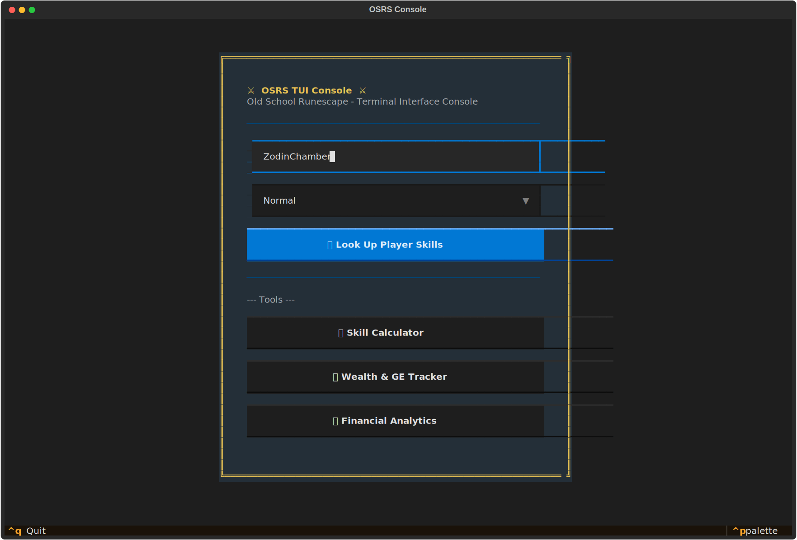
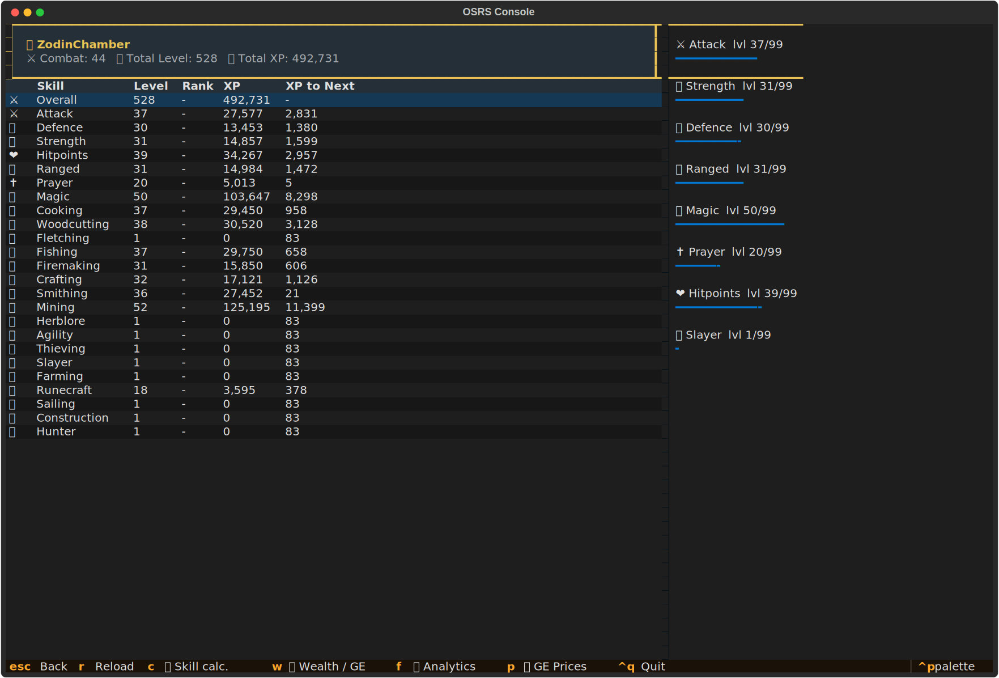
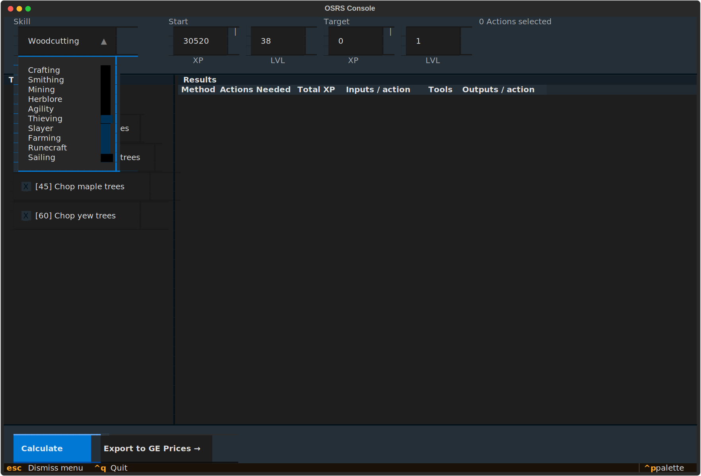
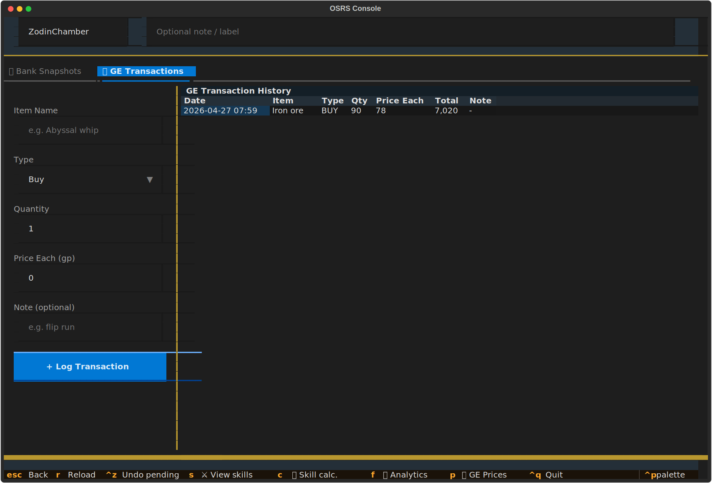

# osrs_console

A TUI application that features several invaluable utilities for your Old School Runescape Character.

## Installation

```bash
$ pip install osrs_console
```

##Usage



---



---



---



---

## Contributing

Interested in contributing? Check out the contributing guidelines. Please note that this project is released with a Code of Conduct. By contributing to this project, you agree to abide by its terms.

## License

`osrs_console` was created by Dylan Garrett. It is licensed under the terms of the MIT license.

## Credits

`osrs_console` was created with [`cookiecutter`](https://cookiecutter.readthedocs.io/en/latest/) and the `py-pkgs-cookiecutter` [template](https://github.com/py-pkgs/py-pkgs-cookiecutter).
